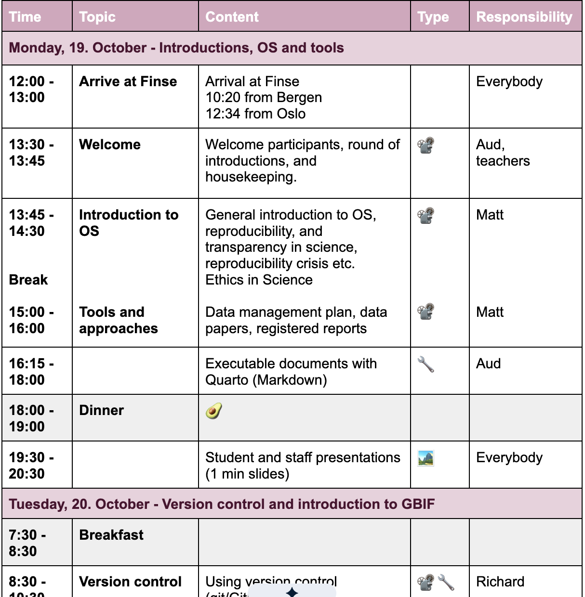
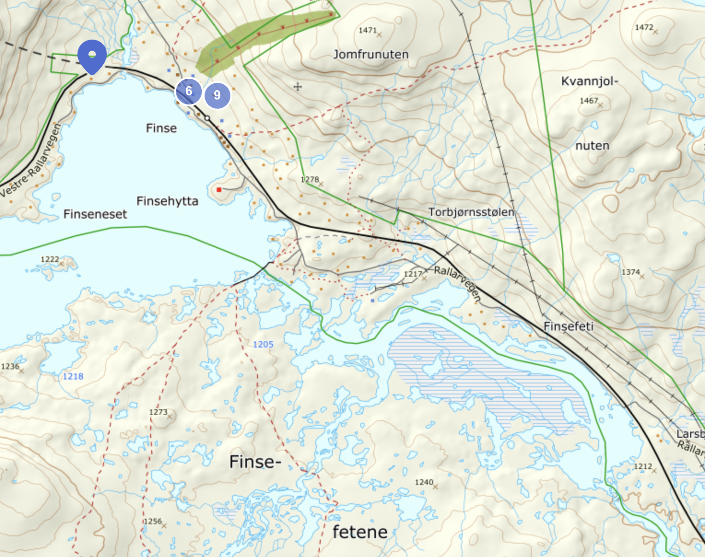
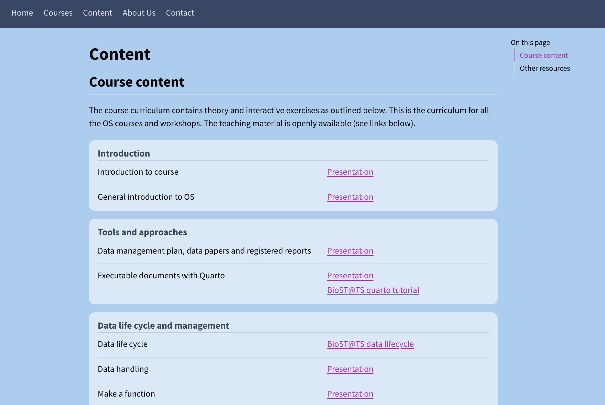

## Welcome to OS course 2026 in Finse {style="font-size: 1.35em;"}

::: {style="position: relative; height: 560px;"}
{style="position: absolute; width: 42%; top: 4%; left: 4%; transform: rotate(-7deg); box-shadow: 0 8px 20px rgba(0,0,0,0.35); z-index: 2;"}
{style="position: absolute; width: 44%; top: -16%; right: -4%; transform: rotate(5deg); box-shadow: 0 8px 20px rgba(0,0,0,0.35); z-index: 3;"}
{style="position: absolute; width: 40%; bottom: -6%; left: 14%; transform: rotate(4deg); box-shadow: 0 8px 20px rgba(0,0,0,0.35); z-index: 4;"}
{style="position: absolute; width: 43%; bottom: -2%; right: 8%; transform: rotate(-4deg); box-shadow: 0 8px 20px rgba(0,0,0,0.35); z-index: 5;"}
:::

## Aim of the OS course

::: {style="display: flex; justify-content: center; align-items: center; height: 80vh;"}
{style="max-height: 78vh; width: auto; margin: 0;"}
:::

## Schedule

::: {style="display: grid; grid-template-columns: repeat(3, 1fr); gap: 0.7em; font-size: 0.48em;"}

::: {style="background: #f7fafc; border-radius: 12px; padding: 0.75em 0.9em; border-top: 5px solid #2b6cb0;"}
**Monday**

- Introduction to OS
- Reproducible documents
- *Present ourselves*
:::

::: {style="background: #f7fafc; border-radius: 12px; padding: 0.75em 0.9em; border-top: 5px solid #2f855a;"}
**Tuesday**

- Using version control
- Intro to GBIF, Darwin Core, IPT
- *Make an R package*
:::

::: {style="background: #f7fafc; border-radius: 12px; padding: 0.75em 0.9em; border-top: 5px solid #c05621;"}
**Wednesday**

- Data biases
- Excursion + Group photo
- Using AI for data publishing
- *Exercise reproducibility*
:::

::: {style="background: #f7fafc; border-radius: 12px; padding: 0.75em 0.9em; border-top: 5px solid #6b46c1;"}
**Thursday**

- Reproducible workflows
- Best practice data analysis
- Systematic reviews and meta-analysis
:::

::: {style="background: #f7fafc; border-radius: 12px; padding: 0.75em 0.9em; border-top: 5px solid #b83280;"}
**Friday**

- Data handling
- Using functions
- Exercise
:::

::: {style="background: #f7fafc; border-radius: 12px; padding: 0.75em 0.9em; border-top: 5px solid #718096;"}
**Saturday**

- Cleaning and leaving
:::

:::

## Daily schedule

## Excursion - Wednesday

## Wifi Password

Network: eduoram

Password: ...

## Housekeeping

- Room sharing -> see list
- Help with meals prep and do dishes
- Packed lunches (prepare at breakfast)
- We clean the place before leaving (Friday afternoon/evening, Saturday morning)
- Sauna

## Group photo

::: {style="display: flex; justify-content: center; align-items: center; height: 75vh;"}
{style="max-height: 70vh; width: auto; margin: 0;"}
:::

## Teching material

All material from the course will be available after the course on [github](https://github.com/Open-Science-Course/OS-training-material) with an overview on the [webpage](https://open-science-course.github.io/course_website/course_content.html).

## Questions?

