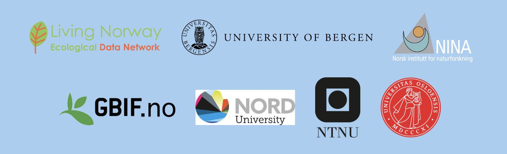

## Welcome to OS course 2026 in Finse

::: {style="position: relative; height: 560px;"}
{style="position: absolute; width: 42%; top: 4%; left: 4%; transform: rotate(-7deg); box-shadow: 0 8px 20px rgba(0,0,0,0.35); z-index: 2;"}
{style="position: absolute; width: 44%; top: -16%; right: -4%; transform: rotate(5deg); box-shadow: 0 8px 20px rgba(0,0,0,0.35); z-index: 3;"}
{style="position: absolute; width: 40%; bottom: -6%; left: 14%; transform: rotate(4deg); box-shadow: 0 8px 20px rgba(0,0,0,0.35); z-index: 4;"}
{style="position: absolute; width: 43%; bottom: -2%; right: 8%; transform: rotate(-4deg); box-shadow: 0 8px 20px rgba(0,0,0,0.35); z-index: 5;"}
:::

## Collaboration

## Aim of the OS course

::: {style="display: flex; justify-content: center; align-items: center; height: 80vh;"}
{style="max-height: 78vh; width: auto; margin: 0;"}
:::

## Schedule

::: {style="font-size: 40%;"}
+-----------+--------------------------------------+
| Day       | Topic                                |
+===========+======================================+
| Monday    | Arriving                             |
|           | Introduction to OS    
|           |                                      |
|           | Reproducible documents               |
|           |                                      |
|           | Present ourselves                    |
+-----------+--------------------------------------+
| Tuesday   | Using version control      |
|           |                                      |
|           | Intro to GBIF, Darwin Core, IPT      |
|           |                                      |
|           | Make an R package                    |
+-----------+--------------------------------------+
| Wednesday | Data biases                          |
|           |                                      |
|           | Excursion + Group photo              |
|           |                                      |
|           | Using AI                             |
|           |                                      |
|           | Exercise reproducibility             |
+-----------+--------------------------------------+
| Thursday  | Reproducible workflows               |
|           |                                      |
|           | Best practice data analysis          |
|           |                                      |
|           | Systematic reviews and meta-analysis |
+-----------+--------------------------------------+
| Friday    | Data handling                        |
|           |                                      |
|           | Using functions                      |
|           |                                      |
|           | Exercise                             |
+-----------+--------------------------------------+
| Saturday  | Leaving                              |
+-----------+--------------------------------------+
:::

## Daily schedule

## Excursion

## Wifi Password

Network: eduoram

Password: ...

## Housekeeping

- We prepare meals and do dishes
- We do packed lunches (prepare at breakfast)
- We need to clean the place before we leave (Friday evening, Saturday morning)
- Sauna

## Group photo

To do: group photo

## Teching material

All material from the course will be available after the course on [github](https://github.com/Open-Science-Course/OS-training-material) with an overview on the [webpage](https://open-science-course.github.io/course_website/course_content.html).

## Questions?

